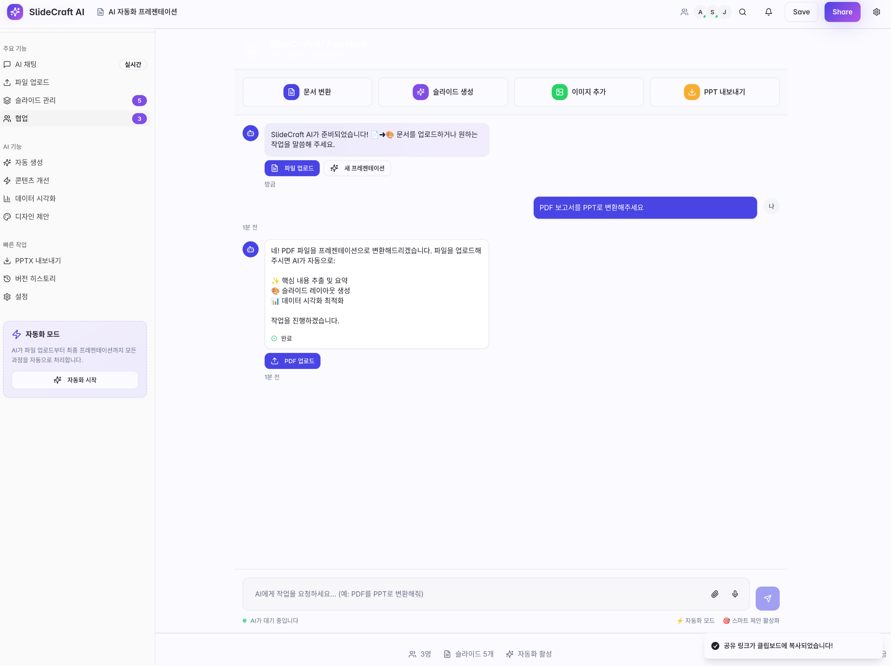

## AI 기반 자동화 프레젠테이션 생성기


*프론트엔드 UI 스켈레톤 디자인*

## 프로젝트 개요

PPT AI Generator는 AI를 활용하여 자동으로 프레젠테이션을 생성하고 편집할 수 있는 웹 애플리케이션입니다. 사용자는 텍스트, 이미지, PDF 등의 다양한 입력을 통해 전문적인 프레젠테이션을 빠르게 생성할 수 있습니다.

### 주요 기능

- **AI 기반 자동 프레젠테이션 생성**: 텍스트 입력을 통한 슬라이드 자동 생성
- **실시간 협업**: 다중 사용자 동시 편집 및 협업 기능
- **채팅 인터페이스**: AI와의 직관적인 대화형 인터페이스
- **실시간 진행 상태 표시**: AI 작업 진행 상황 실시간 모니터링
- **자동 저장**: 작업 내용 자동 저장 및 복원
- **반응형 디자인**: 다양한 디바이스에서 최적화된 사용자 경험

## 기술 스택

### Frontend
- **React 18.3.1** - 메인 프론트엔드 프레임워크
- **TypeScript** - 타입 안전성 보장
- **Vite** - 빠른 개발 서버 및 빌드 도구
- **Tailwind CSS** - 유틸리티 기반 CSS 프레임워크
- **React Router DOM** - 클라이언트 사이드 라우팅

### UI 라이브러리
- **Radix UI** - 접근성이 뛰어난 헤드리스 UI 컴포넌트
- **shadcn/ui** - 재사용 가능한 컴포넌트 라이브러리
- **Lucide React** - 아이콘 라이브러리
- **Tailwind CSS Animate** - 애니메이션 효과

### 상태 관리 & 데이터
- **React Hook Form** - 폼 상태 관리
- **TanStack Query** - 서버 상태 관리
- **Zod** - 스키마 검증

### 추가 라이브러리
- **Sonner** - 토스트 알림
- **React Resizable Panels** - 리사이즈 가능한 패널
- **Embla Carousel** - 캐러셀 컴포넌트
- **Recharts** - 차트 및 데이터 시각화

## 프로젝트 구조

```
ppt-ai-generator/
├── src/
│   ├── components/          # 재사용 가능한 React 컴포넌트
│   │   ├── ui/             # shadcn/ui 기반 기본 UI 컴포넌트
│   │   ├── AIChatInterface.tsx    # AI 채팅 인터페이스
│   │   ├── AIStatusBar.tsx        # AI 상태 표시바
│   │   ├── AppShell.tsx           # 앱 레이아웃 쉘
│   │   ├── AppSidebar.tsx         # 애플리케이션 사이드바
│   │   └── Header.tsx             # 헤더 컴포넌트
│   ├── pages/              # 페이지 컴포넌트
│   │   ├── Index.tsx       # 메인 페이지
│   │   └── NotFound.tsx    # 404 페이지
│   ├── hooks/              # 커스텀 React 훅
│   ├── lib/                # 유틸리티 및 라이브러리
│   ├── App.tsx             # 메인 애플리케이션 컴포넌트
│   └── main.tsx            # 애플리케이션 진입점
├── public/                 # 정적 파일
├── Images/                 # 프로젝트 이미지 및 스크린샷
├── dist/                   # 빌드된 파일
└── 설정 파일들
```

## 시작하기

### 필수 요구사항
- Node.js 18.0.0 이상
- npm 또는 yarn 패키지 매니저

### 설치 및 실행

1. **저장소 클론**
   ```bash
   git clone <repository-url>
   cd ppt-ai-generator
   ```

2. **의존성 설치**
   ```bash
   npm install
   ```

3. **개발 서버 실행**
   ```bash
   npm run dev
   ```
   
   애플리케이션이 `http://localhost:5173`에서 실행됩니다.

### 사용 가능한 스크립트

```bash
npm run dev          # 개발 서버 실행
npm run build        # 프로덕션 빌드
npm run build:dev    # 개발 모드 빌드
npm run lint         # ESLint 실행
npm run preview      # 빌드된 앱 미리보기
```

## 주요 컴포넌트

### 1. AIChatInterface
AI와의 대화형 인터페이스를 제공하는 컴포넌트입니다.
- 사용자 메시지 입력 및 전송
- AI 응답 실시간 표시
- 작업 진행 상황 모니터링

### 2. AIStatusBar
AI 작업 상태와 시스템 정보를 표시하는 하단 상태바입니다.
- 현재 AI 작업 단계 표시
- 진행률 프로그레스 바
- 협업자 수 및 자동 저장 상태

### 3. AppShell
애플리케이션의 전체 레이아웃을 관리하는 쉘 컴포넌트입니다.
- 헤더, 사이드바, 메인 콘텐츠, 푸터 영역 관리
- 반응형 레이아웃 지원

### 4. Header
상단 헤더 영역으로 문서 제목과 주요 액션을 포함합니다.
- 문서 제목 표시
- 협업자 아바타 목록
- 저장 및 공유 버튼

## UI/UX 특징

- **모던한 디자인**: Tailwind CSS를 활용한 깔끔하고 현대적인 인터페이스
- **다크 모드 지원**: next-themes를 통한 라이트/다크 테마 전환
- **반응형 레이아웃**: 다양한 화면 크기에 최적화된 레이아웃
- **접근성**: Radix UI 기반의 웹 접근성 표준 준수
- **부드러운 애니메이션**: tailwindcss-animate를 통한 자연스러운 전환 효과

## 개발 환경 설정

### ESLint 설정
프로젝트는 다음 ESLint 규칙을 사용합니다:
- TypeScript ESLint 권장 설정
- React Hooks 규칙
- React Refresh 규칙

### TypeScript 설정
- 엄격한 타입 검사 활성화
- 절대 경로 import 지원 (`@/` 별칭)
- 최신 ES 기능 지원

---
