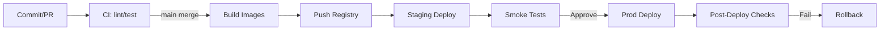

# Deployment Guide

## 1. 목적 & 범위
개발(Dev), 스테이징(Staging), 프로덕션(Prod) 환경에 SlideCraft AI를 일관되게 배포하고 안전하게 롤백하기 위한 표준 절차 정의.

## 2. 환경 개요
| 항목 | Dev | Staging | Prod |
|------|-----|---------|------|
| 배포 빈도 | 수시(개발자) | 1~N회/일 | 1~3회/주 |
| 데이터 영속 | 임시(리셋 허용) | 부분 유지 | 완전 유지 + 백업 |
| 스케일 | 단일/저사양 | 축소본 | 오토스케일 |
| 모니터링 | 최소 | 부분 | 완전 (SLO) |
| Feature Flags | 실험 활성 | Pre-prod 검증 | 기본 안정 |

## 3. 구성 요소
- Gateway(API) - Node.js
- Worker Convert / Worker Export - Python (Celery/RQ)
- Realtime Service - WebSocket(Yjs/Socket.io)
- DB - PostgreSQL
- Cache/Queue - Redis (또는 Redis + RabbitMQ 옵션)
- Object Storage - S3 / MinIO / GDrive
- Metrics Stack - Prometheus + Grafana
- Logs - Loki or Cloud Provider Logs

## 4. 아티팩트 빌드
| 컴포넌트 | 빌드 커맨드 | 산출물 | 태깅 규칙 |
|----------|-------------|--------|-----------|
| Gateway | docker build -f Dockerfile.gateway | image: gateway | app:<semver>-<sha> |
| Worker | docker build -f Dockerfile.worker | image: worker | worker:<semver>-<sha> |
| Realtime | docker build -f Dockerfile.realtime | image: realtime | rt:<semver>-<sha> |
| Frontend | npm run build | dist/ static | fe:<semver>-<sha> |

- 태그 표준: `<component>:<major.minor.patch>-<gitShortSha>`
- LATEST 사용 금지 (재현성 저하)

## 5. 환경 변수 / 시크릿
| 변수 | 예시 | scope | 주석 |
|------|------|-------|------|
| DB_URL | postgres://... | All | 연결 문자열 |
| REDIS_URL | redis://... | All | Queue/Cache |
| JWT_SECRET | **** | Gateway/Realtime | JWT 서명 |
| S3_BUCKET | slidecraft-dev | Worker/Gateway | Storage 선택 시 |
| OPENAI_API_KEY | **** | Gateway/Worker(AI) | Provider Key |
| STORAGE_PROVIDER | local|s3|gdrive | All | 어댑터 선택 |
| VITE_API_BASE_URL | /api | Frontend | FE 빌드 시 |

- 시크릿 주입: Dev - .env.local; Staging/Prod - Secret Manager(KMS 암호화) + CI Vault
- Validation: 부팅 시 스키마 검사 (누락 → fail fast)

## 6. 배포 파이프라인 (CI/CD)

## 7. Staging 배포 절차
1. main merge → 자동 이미지 빌드 & 태깅
2. Infra manifest 업데이트(kustomize/helm values)
3. Rolling Update (maxUnavailable=0, maxSurge=1)
4. Smoke Test 스크립트 실행 (핵심 API + FE 라우팅)

## 8. Prod 배포 전략
| 전략 | 적용 조건 | 장점 | 주의 |
|------|----------|------|------|
| Rolling | 소규모 변경 | 다운타임 없음 | 장기 연결 커넥션 drain 고려 |
| Blue/Green | 대규모 스키마/관측 변경 | 빠른 롤백 | 비용 증가 |
| Canary | 위험 기능 플래그 | 점진적 검증 | 트래픽 라우팅 필요 |

기본: Rolling → 고위험 변경 시 Canary 후 Blue/Green.

## 9. 마이그레이션
- 도구: Prisma or Flyway or Alembic (선택 확정 필요)
- 정책: backward-compatible 먼저(컬럼 추가), 코드 업데이트, 제거는 다음 릴리즈
- 실행 순서: (1) Build (2) Migration Apply (3) App Deploy
- 실패 시: 롤백 스크립트/스냅샷(Prod 백업)

## 10. Realtime & 롱커넥션 처리
- 드레인: 새 파드 준비 → 오래된 파드 readiness 제거 → 60s 커넥션 자연 종료 유도
- Sticky Session 필요 시 Ingress annotation (대안: token 기반 재동기)

## 11. 캐시 / 큐 초기화
- Redis flush 금지(다른 키 영향) → Namespaced prefixes 사용(job:, presence: ...)
- 큐 Draining: 배포 직전 new job enqueue 잠시 중단(Feature flag) → 처리 후 배포

## 12. 모니터링 게이트
| 체크 | 조건 | 실패 대응 |
|------|------|-----------|
| Job Success Rate (5m) | >95% | 실패시 배포 중지 |
| API Error Rate | <2% | 높으면 조사 후 중단 |
| DB 마이그레이션 시간 | <60s | 초과시 롤백 고려 |

## 13. 롤백 절차
1. 문제 탐지 (알림/로그/SLO 위반)
2. 현재 이미지 태그 기록
3. 이전 안정 버전 태그로 재배포
4. 마이그레이션 역방향 필요 여부 판단 (불가 시 remain & hotfix)
5. Incident Runbook 기록 & Postmortem 일정 등록

## 14. 배포 후 검증 (Post-Deploy Checks)
- /healthz, /readyz 200 OK
- 샘플 Upload→Convert Job 성공
- AI Chat SSE 첫 토큰 <2s
- Export PPTX 1개 성공
- 대시보드: job_duration, ai_latency 업데이트 반영

## 15. 비용 / 최적화 고려
| 영역 | 기법 | 초기 값 |
|------|------|---------|
| Worker Autoscale | CPU 70% / Queue Length | min 1 / max 5 |
| DB Instance | 연결 풀 20 | PgBouncer 고려 |
| Object Storage | Lifecycle rule 30d | Temp export 7d 삭제 |
| AI 비용 | 모델 fallback | 고비용 모델 usage 모니터 |

## 16. 보안 / 컴플라이언스
- 이미지 서명(Cosign) 고려
- SBOM 생성(syft/grype)
- 최소 권한 서비스 계정(K8s RBAC)
- Secrets: at rest encryption(KMS), rotation 정책 분기별

## 17. 위험 & 완화
| 위험 | 영향 | 완화 |
|------|------|------|
| 마이그레이션 롤백 불가 | 데이터 불일치 | Feature toggle + shadow write 검증 |
| 대규모 이미지 Pull 지연 | 배포 지연 | 레지스트리 캐시/프리풀 |
| Worker/Gateway 버전 불일치 | Job 실패율 증가 | 호환 버전 매트릭스 테스트 |
| 실시간 세션 대량 종료 | 사용자 경험 저하 | 점진 파드 교체 + 백오프 재연결 |

## 18. 향후 개선
- Terraform/IaC 정식화
- Progressive Delivery (Argo Rollouts) 도입
- GitOps (ArgoCD) 전환
- Multi-region DR Runbook 작성

## 19. 참고 문서
- monitoring-observability.md
- job-lifecycle-spec.md
- error-taxonomy-and-recovery.md
- openapi-spec-enhancement.md
