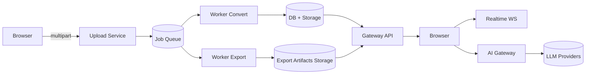
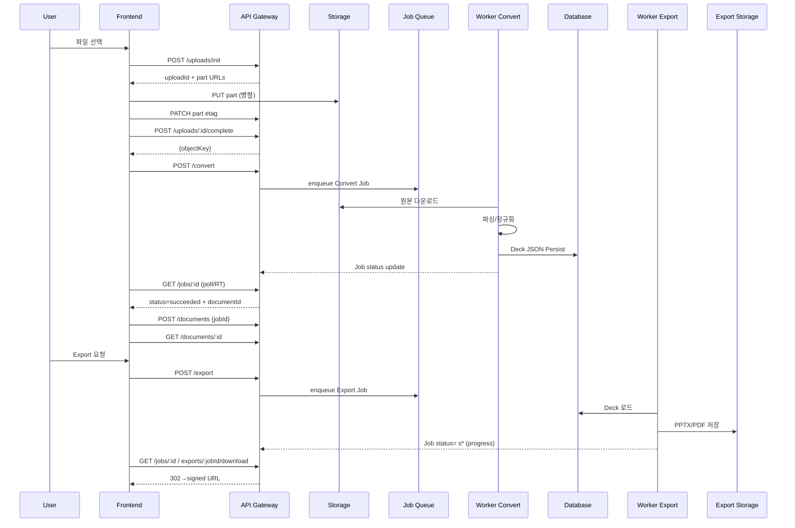
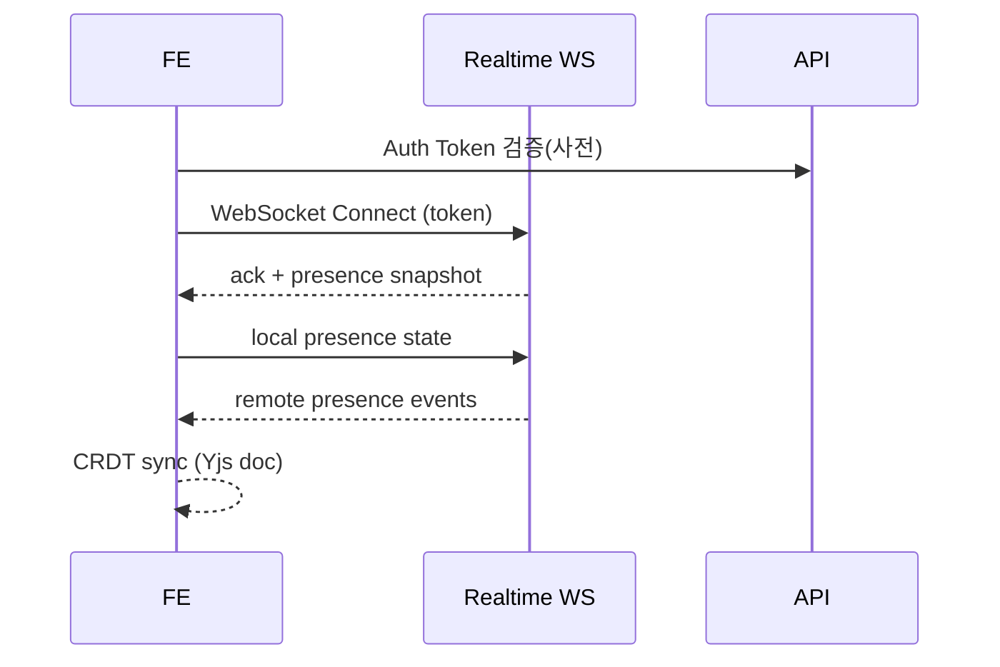

# End-to-End Workflows

## 1. 목적 & 범위
SlideCraft AI 핵심 사용자 플로우(업로드→변환→편집/협업→AI→내보내기)와 시스템 레벨 상호작용을 전체적으로 정의한다. 이 문서의 산출물은 테스트 전략, 모니터링 지표, 에러/재시도 정책 및 SLO 설계의 기준이 된다.

## 2. 배경 / 문제 정의
현재 개별 서비스/기능 문서는 존재하나 서비스 간 경계(업로드→Job→문서생성→CRDT 동기→Export) 전환 시 명확한 지연 목표·실패 브랜치·데이터 일관성 규칙이 부족. 이를 통합하여 운영/품질/디버깅 효율을 향상.

## 3. 성공 기준 / 지표
| 구분 | 메트릭 | 목표(P95) | 설명 |
|------|--------|-----------|------|
| Upload Init | latency_ms | <300ms | /uploads/init 응답 |
| Convert Job | duration_ms | <15000ms (50MB PDF) | Worker 처리시간 |
| Editor Entry | t_convert_done→editor_load | <2000ms | 문서 fetch + 초기 렌더 |
| AI Response | first_token_ms | <1500ms | SSE 첫 delta 수신 |
| Export PPTX | duration_ms | <8000ms (중간 Deck) | worker-export 완료 |
| Export Download | t_click→first_byte | <1200ms | 서명 URL/네트워크 |

## 4. 상위 아키텍처 다이어그램 (Placeholder)

## 5. 도메인 엔터티 & 스키마 스냅샷
- UploadSession(uploadId, parts[], checksumAlgo)
- Job(id, type, status, progress, error, payload, result)
- Document(id, ownerId, deckSchemaVersion, updatedAt)
- DeckJSON(version, slides[], assets, styles)
- ExportArtifact(jobId, format, size, url, expiresAt)

## 6. 핵심 사용자 플로우 상세
### 6.1 Flow A: Upload → Convert → Document → Export
#### 단계 시퀀스

#### 실패/분기 테이블 (요약)
| 단계 | 실패 원인 | 감지 | 사용자 처리 | 시스템 재시도 | 로깅 키 |
|------|-----------|------|-------------|---------------|---------|
| Upload part | 네트워크 끊김 | 5xx/timeout | 재시도 버튼 | FE 지수 backoff(최대 5) | uploadId, partNumber |
| Convert | Parser 오류 | job.status=failed | 지원 형식 안내 | Worker 3회 backoff | jobId, sourceType |
| Document fetch | 404 Race | GET 실패 | 1초 후 재요청 | 3회 | documentId |
| Export | 렌더 실패 | job.status=failed | 재시도/로그 링크 | Worker 2회 | jobId, format |
| Download | 서명 만료 | 403 | 재요청 | 새 URL 발급 | jobId |

### 6.2 Flow B: AI Chat → Slide 삽입
- Precondition: Document 로드 & 선택 컨텍스트 준비.
- Steps: POST /ai/chat(stream) → SSE delta 적용 → 사용자 diff 확인 → commit CRDT ops.
- Failure: AI_RATE_LIMIT → 429 → FE 30s 재시도 대기 UI.

### 6.3 Flow C: Realtime Collaboration Join

- 재연결 Backoff: 1s → 2s → 5s → 8s (최대 30s 고정)

### 6.4 Flow D: Document Update → Export Quick Path
- 사용자가 편집 직후 Export 트리거 시, Deck Snapshot stale 여부 검사 → 최신 CRDT state 머지 → Export Job enqueue.

## 7. 인터페이스 / 계약 체크리스트
| 인터페이스 | 검증 항목 | OpenAPI 상태 | 테스트 커버리지 | 노트 |
|------------|-----------|--------------|----------------|------|
| /uploads/* | 체크섬, 재시도 | TODO 확장 | Contract + Large file | 멀티파트 URL 만료 |
| /convert | Idempotency-Key | TODO | Contract | 중복 요청 방지 |
| /jobs/:id | progress 정규화 | 부분 | Poll/E2E | SSE 대체 여부 |
| /documents/:id | deckSchemaVersion | 부분 | Integration | 캐시 헤더 |
| /export | format validation | TODO | Contract | PPTX/PDF only |
| /exports/:jobId/download | 302 서명 | TODO | Integration | 만료 재발급 |
| /ai/chat (SSE) | event delta/json | 부분 | Stream Unit | 에러 이벤트 채널 |

## 8. 정책 (지연·재시도·Idempotency)
- Idempotency-Key: POST /convert, /export, /ai/chat (기본: UUID v4)
- 재시도 백오프 표 (FE): base=1s, factor=2, ceiling=10s, maxAttempts=5
- Worker 재시도: Convert 3회, Export 2회 (지수 1s/4s/9s)
- 타임아웃: Upload part 60s, AI stream connection 30s inactivity

## 9. 구성 / 배포 고려
- Feature Flags: realtime_sse_fallback, ai_multi_provider, export_pdf_beta
- 환경 변수 종속: STORAGE_PROVIDER, OPENAI_API_KEY, REDIS_URL
- Blue/Green 시나리오: Worker 버전 차이 → Deck Schema backward 호환 필요.

## 10. 관측 포인트
| 계층 | 메트릭 | 태그 | 목적 |
|------|--------|------|------|
| API | http_request_duration_seconds | route, status | Latency 추적 |
| Worker | job_duration_seconds | type, status | SLA 검증 |
| FE | web_vitals_lcp_ms | release, browser | UX 품질 |
| AI | ai_latency_ms | provider, model | 비용/성능 튜닝 |
| Realtime | ws_active_connections | region | 용량 계획 |

## 11. 에러 & 복구
- 에러 코드 매핑: 별도 `error-taxonomy-and-recovery.md`
- Circuit Breaker: AI provider 5분 윈도 내 실패율 >30% → fallback 모델.
- Partial Failure: Export 시 특정 슬라이드 asset 누락 → placeholder 삽입 & 경고 로그.

## 12. 테스트 전략 요약 링크
- 세부: `testing-strategy.md`
- 필수 E2E: DOCX→PPTX, PPTX→PDF, AI 요약→슬라이드 삽입, 동시편집 2명 → Export.

## 13. 위험 & 완화 (Top 5)
| 위험 | 영향 | 확률 | 완화 |
|------|------|------|------|
| 대형 PDF 변환 지연 | SLA 위반 | 중 | 워커 autoscale, partial parse streaming |
| AI Provider Rate Limit | UX 지연 | 중 | 다중 provider fallback |
| Realtime 재연결 폭증 | 인프라 부하 | 저 | 백오프 + 세션 TTL |
| Export Fidelity 낮음 | 사용자 신뢰 저하 | 중 | 골든 비교 회귀 테스트 |
| Upload 재시도 폭증 | 스토리지 비용 | 저 | 실패 한계 & metrics 경보 |

## 14. 향후 확장
- 배치 Export, 스케줄링, Delta-Export (변경 슬라이드만) 후보.
- Adaptive Polling → Server Push 전환.

## 15. 용어 사전
- Deck JSON: 편집/재생성 가능한 정규화 프레젠테이션 구조
- Artifact: Export 결과 파일(PPTX/PDF)
- Delta: AI/CRDT 변경 단위

## 16. 참고 문서
- backend/implementation/worker-convert.md
- backend/implementation/worker-export.md
- frontend/implementation/export-flow.md
- integration/dev_prd.md
